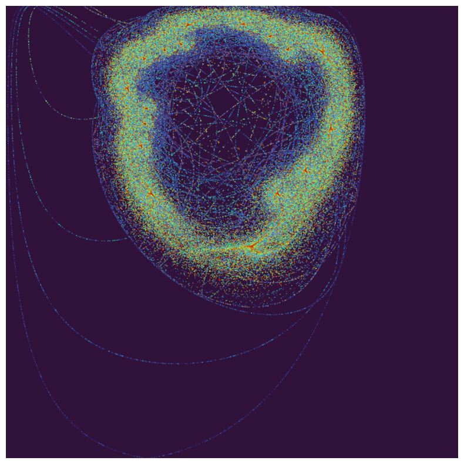
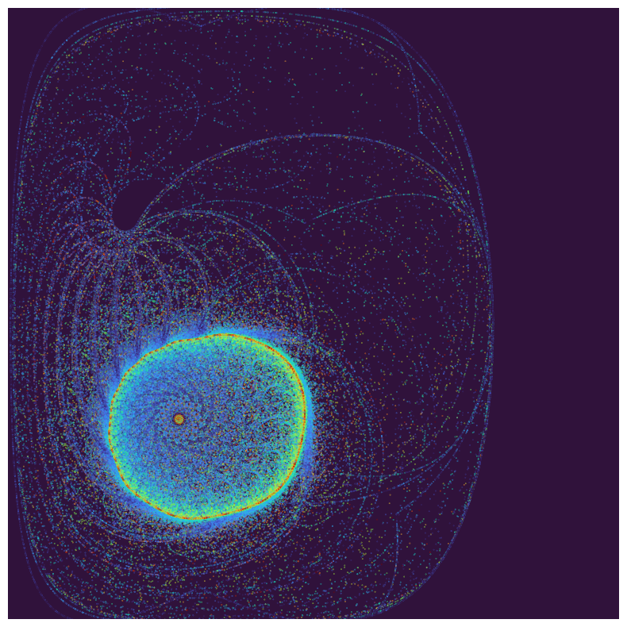
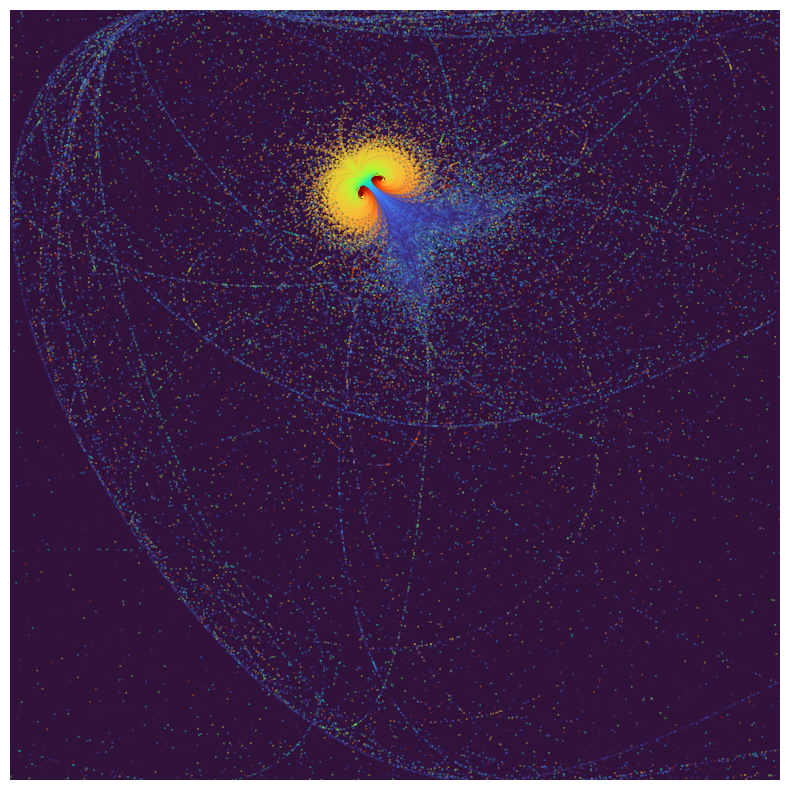
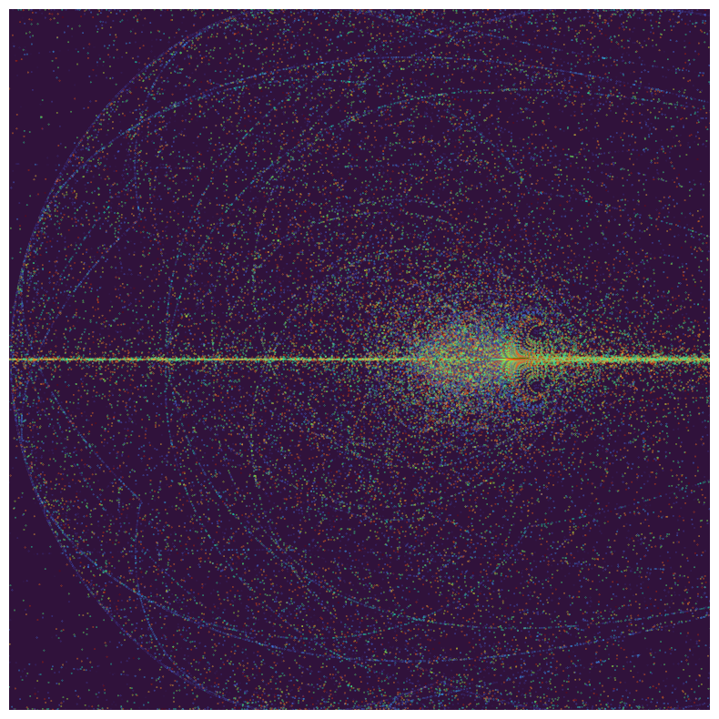

# Collection of small, interesting and fun projects

## [Elementary Cellular Automata 1D](/cellular_automata_1D/ca.ipynb)
Inspired by [this Youtube video by 'The Coding Train'](https://www.youtube.com/watch?v=Ggxt06qSAe4), I recreated an animated version of a simple 1D Cellular Automata.
The Cellular Automata is fully characterized by a single integer number < 255, which is converted into its binary representation. This binary representation forms the ruleset of the automata.

Here is the [Wikipedia](https://en.wikipedia.org/wiki/Elementary_cellular_automaton) article on elementary cellular automata.

A 1D row of 0's or 1's is evolved through iterations of the ruleset. 

The resulting new row is stacked onto the previous rows, resulting in images like this:

## [Orbits](/orbits/orbits.ipynb)
Inspired by a X(Twitter) post, I recreated an animated version of an attractor-like equation, presented simply as "Orbits".
The orbits are soley defined by the equations

    x_next = sin(x**2 - y**2 + c1)
    y_next = cos(2*x*y + c2)
    
The equations can, theoretically, be exchanged with any (periodic) trigonometric function, such as the tan.

Evaluating the equations and varying c2 results in the these videos:

sin in the first equation

tan instead of sin in the first equation

Evaluating the equations results in images like this:

sin in the first equation

tan instead of sin in the first equation

