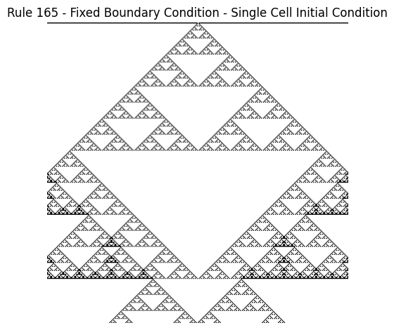

# Collection of small, interesting and fun projects

## [Elementary Cellular Automata 1D](/cellular_automata_1D/ca.ipynb)
Inspired by [this Youtube video by 'The Coding Train'](https://www.youtube.com/watch?v=Ggxt06qSAe4), I recreated an animated version of a simple 1D Cellular Automata.
The Cellular Automata is fully characterized by a single integer number < 255, which is converted into its binary representation. This binary representation forms the ruleset of the automata.

Here is the [Wikipedia](https://en.wikipedia.org/wiki/Elementary_cellular_automaton) article on elementary cellular automata.

A 1D row of 0's or 1's is evolved through iterations of the ruleset. 

The resulting new row is stacked onto the previous rows, resulting in images like this:

