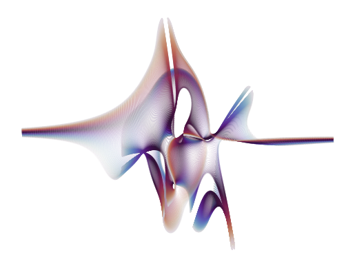

# Eigenvalue Visualizer

Short [Jupyter Notebook](eigenvalue_visualizer.ipynb) to visualize the Eigenvalues of special square matrices

Takes a complex `N x N` matrix with two randomly chosen variable elements.

Calculates the Eigenvalues of this matrix varying the two variable elements.

Plots the resulting Eigenvalues.

# Possible results

## N = 3

## N = 5

## N = 10

## N = 15

## N = 50

